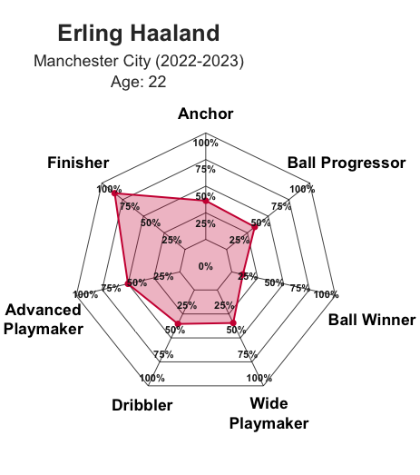
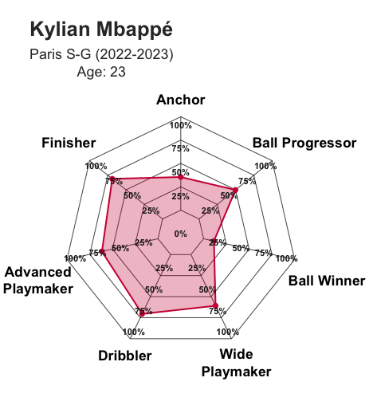
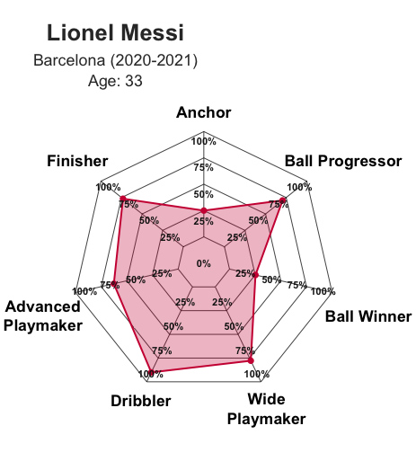
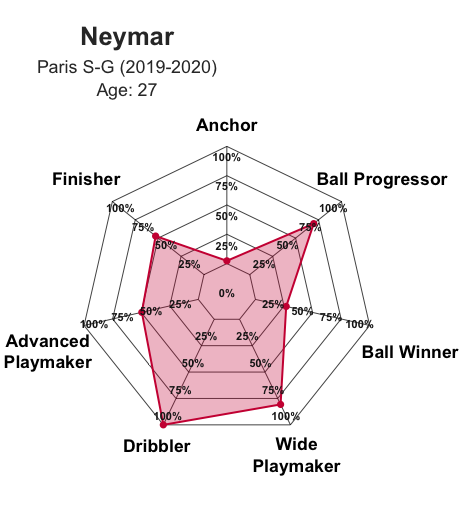
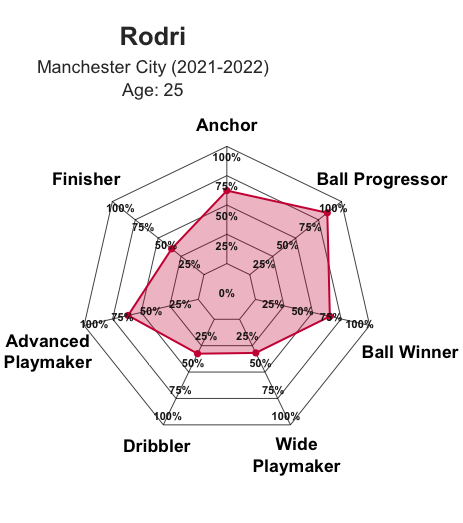
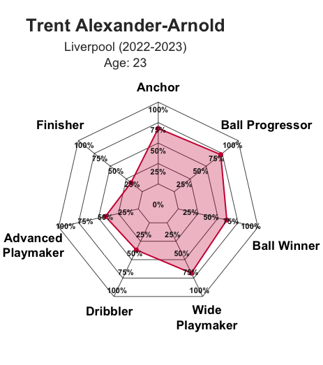
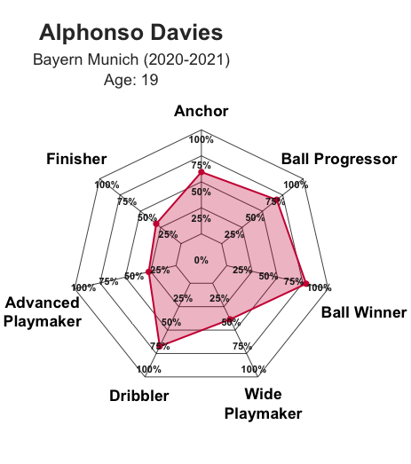
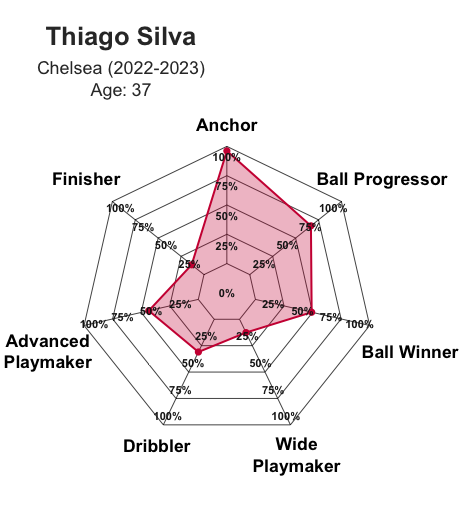
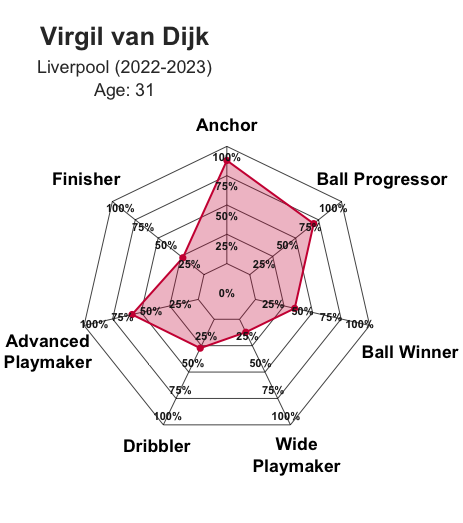

# Football Player Market Value and Archetype Analysis

**Authors:** Tirdod Behbehani and Timothy Cassel

This project investigates two key questions:
- What statistical indicators best predict a player's market value?
- Can we use unsupervised learning to identify player archetypes?

## Motivation

**Player Market Value:**

We aim to predict the market values of football players in the top five
European leagues from the 2019/20 through the 2022/23 seasons. This project
investigates which on-pitch performance metrics, such as goals and assists, are
most predictive of a player's estimated value on the open market. This allows us
to understand what truly drives player worth, and how each player's performance
metrics impact his valuation. An analytical understanding of a player's market value 
and a data-driven recruitment strategy adds context and leads to more informed decision making.

While this project only investigates market value, market value should always be used in tandem 
with on-pitch value. Using both metrics in tandem can help us understand whether a player is undervalued, 
overvalued, or fairly priced. The use of up-to-date performance with future projections, an 
organization is now able to understand the current scope of prospective transfers, while 
also better understanding how the transfer could age over time and the potential re-sale value of the player.

**Player Archetype Classification:**

Beyond just pure valuation, understanding the style of a player and his contributions to winning
is vital. Beyond just using positions (ex. central midfielder), we can study player archetypes 
to exactly what a player is bringing to the table (ex. box to box midfielder, playmaking midfielder,
ball-winning midfielder). This type of analysis can unearth subtleties to a player's game, and help teams
understand what kind of player it desires in different roles, and then understanding who the best options
on the marketplace are for that role. It allows us to bridge the gap between raw intuition
and provide substantive player profile analysis.

## Data
This project integrates two publicly available datasets from Kaggle, 
integrating FBref and Transfermarkt data:
- [Player Stats From Top European Football Leagues (FBref)](https://www.kaggle.com/datasets/beridzeg45/top-league-footballer-stats-2000-2023-seasons/data)  
- [Football Data from Transfermarkt](https://www.kaggle.com/datasets/davidcariboo/player-scores)

## Results

**Player Market Value**

- Value rises with age up to a certain point, then declines. Upon further investigation, this "peak age" point is when a player is 27 years old.
- Playing time, goals, and xG were strong positive predictors, emphasizing performance output. Defensive metrics like Tackles Won and Interceptions had weak or negative influence, reflecting market bias toward offensive output. This is further supported by being a Forward or Midfielder positively influencing market value.
- Progressive Passes and Successful Take-Ons highlighted the value of creativity and ball progression on market value.
- Player club has a major impact on a player's market valuation. However, this is partly due to reputational and financial biases in Transfermarkt's valuations. When a young player from a small club moves to a big club, we observe the player's market value skyrocket, even in the absence of any performance change. This highlights the importance of incorporating  on-pitch value into player market value analysis.

Intuitively, we see our results confirm how young, attacking players who receive suitable playing time are strong performance-based indicators of market value. 

While our models explain a sizable portion of variance (R² ≈ 0.71), there are many latent, unobserved variables such as agent influence, social media presence, player wages, or medical history that contribute to the residual noise in player market valuation. Future research could improve predictive power by incorporating transfer history, wage data, or clustering position-specific player groups in the market value model.

**Player Archetype Classification:**

While K-means clustering struggled, PCA and Sparse PCA showed promise in their ability to reduce dimensionality and separate players into archetypes. Sparse PCA was able to identify seven interpretable player archetypes.

- **Anchor**: Back-line defenders who sweep up opponent attacks. Key metrics include tackles, blocked shots, fouls, clearances, miscontrols, and dispossessions.
- **Ball Progressor**: Deep lying playmakers who control the tempo and build up from deep positions. Key metrics include forward passes, touches in middle third, carries, short passes, and medium distance passes.
- **Ball Winner**: Players who break up play and win the ball. Key metrics include passe blocked, loose ball recoveries, interceptions, and dribblers tackled.
- **Wide Playmaker**: Creators from wide areas. Key metrics include crosses, passes into penalty area, and passes leading to shots.
- **Dribbler**: Players who take opponents off the dribble. Key metrics include successful take ons, progressive carries, carries into the penalty area, and carries into the final third
- **Advanced Playmaker**: Players who create shooting opportunities for others. Key metrics include key passes, assists, and expected assists.
- **Finisher**: Goal scorers. Key metrics include goals, expected goals, and shots on target.

Some sample player archetype player plots are included below:

  
  

  
  

  
  

  
  

  
  

## Opportunities for Future Research
- Trying to predict a player’s market value by estimating the player’s on-field value,
then leveraging latent variable analysis to uncover hidden features which influence a player’s market value.
- Understanding what are the similarities between players who might not be receiving much playing time
at their current club who break out and excel at a different club.
- Building separate models to predict market valuations for defenders, midfielders, and forwards,
leveraging insights from our Sparse PCA to guide parameter tuning.
- Understanding what are the "swing skills" between positive and negative
future outcomes for a given player. Can we model the range of outcomes for
the swing skills?
